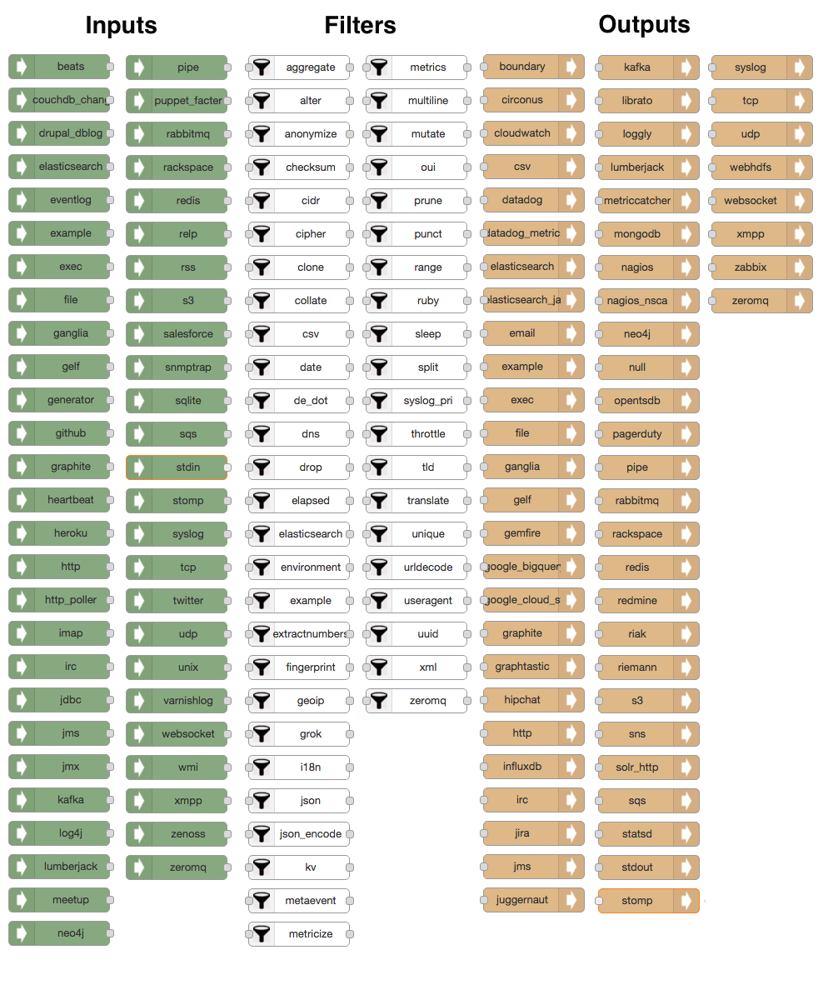

# Node-RED Logstash nodes 

This project aims at providing a set of [Node-RED](http://nodered.org) nodes for modeling and executing any Logstash pipelines.

## Context

The [Node-RED project](http://nodered.org) provides a nice visual tool for wiring the Internet of Things. 

We started from the assumption that if you can wire IoT devices, you can wire anything. So, the initial idea 
of this project is to use the excellent environment offered by the Node-RED platform in order to visually model
Logstash pipelines as Node-RED flows. This project thus aims at providing all Logstash components (i.e. [inputs](https://www.elastic.co/guide/en/logstash/current/input-plugins.html), [outputs](https://www.elastic.co/guide/en/logstash/current/output-plugins.html) and [filters](https://www.elastic.co/guide/en/logstash/current/filter-plugins.html)) 
in the form of additional Node-RED nodes that anyone can easily assemble into her own Logstash pipeline instead of 
having to [write the configuration file manually](https://www.elastic.co/guide/en/logstash/current/configuration.html).

Using these nodes, one will not only be empowered to model her Logstash pipelines in a neat visual environment, but 
such pipelines can also be executed inside the Node-RED runtime.

Visual modeling and real-time execution of Logstash pipelines are nice, but there's more. Once the pipeline executes
according to your expectations, you can generate and export the corresponding Logstash configuration file in order to 
use it on the Logstash command-line.

Finally, the Node-RED ecosystem also allows contributors to [share their flows](http://flows.nodered.org) in the open Node-RED library for others to reuse.

To sum up, this project can be seen as some sort of missing Visual IDE for Logstash, which allows you to:
 * **visually model** a full-blown Logstash pipeline by dragging and dropping input/filter/output nodes and wiring them together as Node-RED flows
 * **execute** the Logstash pipeline in real-time inside the Node-RED runtime (in progress)
 * **generate** the equivalent Logstash configuration you'd have written by hand otherwise
 * **share** Logstash pipelines (aka Node-RED flows) with the community
 * **reverse-engineer** existing Logstash pipelines into Node-RED flows (in progress)
 
## Installation

1. First, follow the steps to [install the Node-RED environment](http://nodered.org/docs/getting-started/installation.html).
By default, Node-RED installs into your home directory in `.node-red`.

2. `> mkdir ~/.node-red/nodes`

3. `> cd ~/.node-red/nodes`

4. Install this package via `npm`: `sudo npm install node-red-contrib-logstash`

5. Fire up Node-RED: `> node-red

6. Open your browser at [http://localhost:1880](http://localhost:1880)

## How to use

Once Node-RED is started, you'll find all the Logstash nodes in the left sidebar.



You can drag and drop them into the workspace on the right and visually compose your pipeline.


This very simple pipeline basically corresponds to the following Logstash configuration:

```
input {
  file {
    codec => "json"
    path => "/home/me/test.log"
    type => "test"
  }
  file {
    codec => "json"
    path => "/home/me/test2.log"
    type => "test2"
  }
}
filter {
  if [type] == "test" {
    mutate {
      lowercase => "first_name"
    }
  }
  if [type] == "test2" {
    mutate {
      lowercase => "last_name"
    }
  }
}
output {
    stdout {
      codec => "rubydebug"
  }
}
```

And now the limit is the sky!

## Future features

Another neat feature that this project is going to support is the ability to input a Logstash configuration and
automatically create the corresponding flow, which can then be further re-arranged and modified.
Yes, round-trip Logstash engineering!