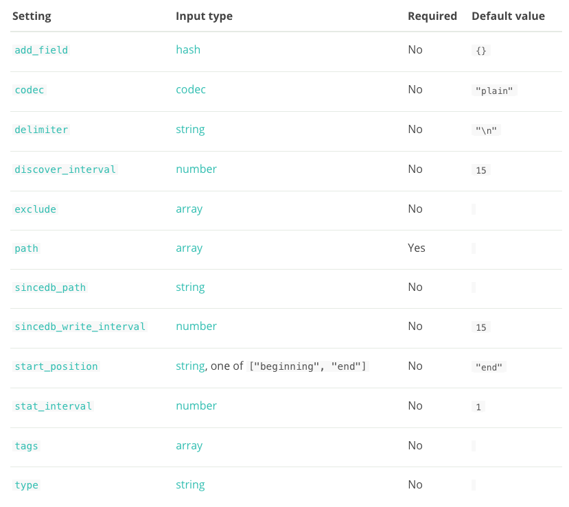
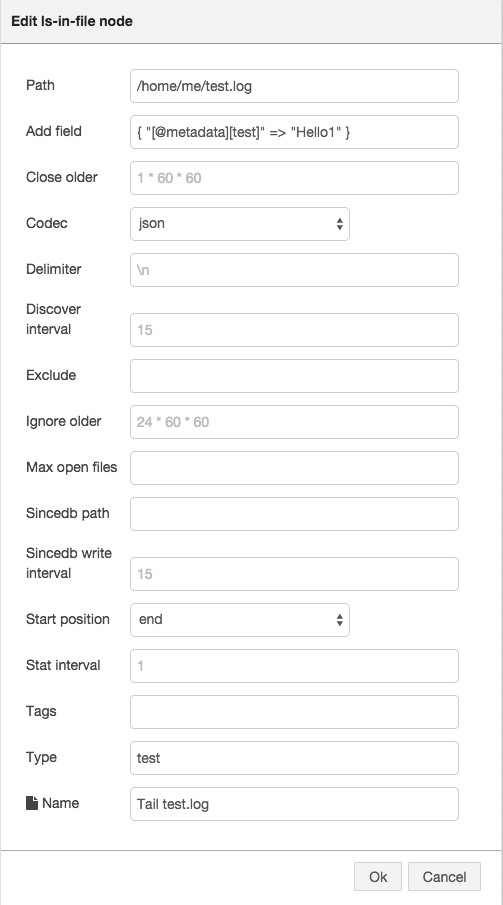

# Node-RED Logstash nodes 

This project aims at providing a set of [Node-RED](http://nodered.org) nodes for modeling and executing any Logstash pipelines.

## Context

The [Node-RED project](http://nodered.org) provides a nice visual tool for wiring the Internet of Things. 

We started from the assumption that if you can wire IoT devices, you can wire anything. So, the initial idea 
of this project is to use the excellent environment offered by the Node-RED platform in order to visually model
Logstash pipelines as Node-RED flows. This project thus aims at providing all Logstash components (i.e. [inputs](https://www.elastic.co/guide/en/logstash/current/input-plugins.html), [outputs](https://www.elastic.co/guide/en/logstash/current/output-plugins.html) and [filters](https://www.elastic.co/guide/en/logstash/current/filter-plugins.html)) 
in the form of additional Node-RED nodes that anyone can easily assemble into her own Logstash pipeline instead of 
having to [write the configuration file manually](https://www.elastic.co/guide/en/logstash/current/configuration.html).

Using these nodes, one will not only be empowered to model her Logstash pipelines in a neat visual environment, but 
such pipelines can also be executed inside the Node-RED runtime.

Visual modeling and real-time execution of Logstash pipelines are nice, but there's more. Once the pipeline executes
according to your expectations, you can generate and export the corresponding Logstash configuration file in order to 
use it on the Logstash command-line.

Another neat feature that this project is going to support is the ability to parse any existing Logstash configuration and
automatically create the corresponding Node-RED flow, which can then be further re-arranged, improved, modified and re-exported.
**Yes, round-trip Logstash engineering!**

Finally, the Node-RED ecosystem also allows contributors to [share their flows](http://flows.nodered.org) in the open Node-RED library for others to reuse.

To sum up, this project can be seen as some sort of missing Visual IDE for Logstash, which allows you to:
 * **visually model** a full-blown Logstash pipeline by dragging and dropping input/filter/output nodes and wiring them together as Node-RED flows
 * **generate** the equivalent Logstash configuration you'd have written by hand otherwise
 * **share** Logstash pipelines (aka Node-RED flows) with the community
 * **execute** the Logstash pipeline in real-time inside the Node-RED runtime (in progress)
 * **reverse-engineer** existing Logstash pipelines into Node-RED flows (in progress)
 
## Installation

1. First, follow the steps to [install the Node-RED environment](http://nodered.org/docs/getting-started/installation.html).
By default, Node-RED installs into your home directory in `.node-red`.

2. `> cd ~/.node-red`

3. Install this package via `npm`: `> npm install node-red-contrib-logstash`

4. Fire up Node-RED: `> node-red`

5. Open your browser at [http://localhost:1880](http://localhost:1880)

## How to use

### 1. Drag & drop

Once Node-RED is started, you'll find all the Logstash nodes in the left sidebar.


You can drag and drop them into the workspace and visually compose your pipeline (aka Node-RED flow).


### 2. Configure node settings

The official settings for the `file` input plugin are shown on the figure below (taken from the
[official documentation](https://www.elastic.co/guide/en/logstash/current/plugins-inputs-file.html)):



Once you add a node into the workspace, you can configure its settings by double clicking on the node in order to
open a configuration dialog, such as the one shown below for the `file` input node.

As you can see, all the settings for the `file` input node can be input into text fields or selected from dropdown lists
which are automatically populated by the supported values defined in the respective Logstash plugin.
Similarly, placeholder values show the default settings as configured in the respective Logstash plugin.



### 3. Generate Logstash configuration

The very simple pipeline wired in step 1 above basically corresponds to the following Logstash configuration,
which has been automatically generated from the above pipeline/flow:

```
input {
  # Tail test.log
  file {
    codec => "json"
    path => "/home/me/test.log"
    type => "test"
    add_field => { "[@metadata][test]" => "Hello1" }
  }
  # Tail test2.log
  file {
    codec => "json"
    path => "/home/me/test2.log"
    type => "test2"
    add_field => { "[@metadata][test]" => "Hello2" }
  }
}
filter {
  if [type] == "test" {
    # Lowercase first name
    mutate {
      lowercase => "first_name"
    }
  }
  if [type] == "test2" {
    # Lowercase last name
    mutate {
      lowercase => "last_name"
    }
  }
}
output {
  # Out
  stdout {
    codec => "rubydebug"
  }
}
```

And now the limit is the sky!
